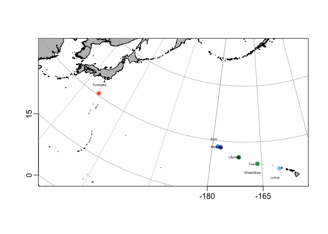

basic-map
================
Diana Baetscher
2023-03-09

## Map of BFAL colony locations in this study

``` r
library(tidyverse)
```

    ## ── Attaching core tidyverse packages ──────────────────────── tidyverse 2.0.0 ──
    ## ✔ dplyr     1.1.3     ✔ readr     2.1.4
    ## ✔ forcats   1.0.0     ✔ stringr   1.5.0
    ## ✔ ggplot2   3.4.4     ✔ tibble    3.2.1
    ## ✔ lubridate 1.9.3     ✔ tidyr     1.3.0
    ## ✔ purrr     1.0.2     
    ## ── Conflicts ────────────────────────────────────────── tidyverse_conflicts() ──
    ## ✖ dplyr::filter() masks stats::filter()
    ## ✖ dplyr::lag()    masks stats::lag()
    ## ℹ Use the conflicted package (<http://conflicted.r-lib.org/>) to force all conflicts to become errors

``` r
library(dplyr)
library(adehabitatHR)
```

    ## Loading required package: sp
    ## Loading required package: ade4
    ## Loading required package: adehabitatMA
    ## Registered S3 methods overwritten by 'adehabitatMA':
    ##   method                       from
    ##   print.SpatialPixelsDataFrame sp  
    ##   print.SpatialPixels          sp  
    ## Loading required package: adehabitatLT
    ## Loading required package: CircStats
    ## Loading required package: MASS
    ## 
    ## Attaching package: 'MASS'
    ## 
    ## The following object is masked from 'package:dplyr':
    ## 
    ##     select
    ## 
    ## Loading required package: boot
    ## 
    ## Attaching package: 'adehabitatLT'
    ## 
    ## The following object is masked from 'package:dplyr':
    ## 
    ##     id

``` r
library(ggplot2)
library(magrittr)
```

    ## 
    ## Attaching package: 'magrittr'
    ## 
    ## The following object is masked from 'package:purrr':
    ## 
    ##     set_names
    ## 
    ## The following object is masked from 'package:tidyr':
    ## 
    ##     extract

``` r
library(sp)
library(raster)
```

    ## 
    ## Attaching package: 'raster'
    ## 
    ## The following object is masked from 'package:MASS':
    ## 
    ##     select
    ## 
    ## The following object is masked from 'package:dplyr':
    ## 
    ##     select

``` r
library(marmap)
```

    ## 
    ## Attaching package: 'marmap'
    ## 
    ## The following object is masked from 'package:raster':
    ## 
    ##     as.raster
    ## 
    ## The following object is masked from 'package:grDevices':
    ## 
    ##     as.raster

``` r
library(oce)
```

    ## Loading required package: gsw
    ## 
    ## Attaching package: 'oce'
    ## 
    ## The following object is masked from 'package:marmap':
    ## 
    ##     plotProfile

``` r
library(ocedata)
```

### bathymetry

Add bathymetric map

``` r
# antimeridian region 
col_area <- getNOAA.bathy(-160, 140, 20, 40, resolution = 1,
antimeridian = T)
```

    ## Querying NOAA database ...

    ## This may take seconds to minutes, depending on grid size

    ## Building bathy matrix ...

``` r
# Make it a raster
bathy <- as.raster(col_area)

# Create a xyz table for ggplot
bath<-fortify(col_area)
```

this mapping from:
<https://hansenjohnson.org/post/bathymetric-maps-in-r/>

``` r
# BFAL colony locations
latlon <- read_csv("../data/latlon_df.csv")
```

    ## Rows: 7 Columns: 3
    ## ── Column specification ────────────────────────────────────────────────────────
    ## Delimiter: ","
    ## chr (1): pop
    ## dbl (2): lat, lon
    ## 
    ## ℹ Use `spec()` to retrieve the full column specification for this data.
    ## ℹ Specify the column types or set `show_col_types = FALSE` to quiet this message.

``` r
data("coastlineWorldFine")

# convert bathymetry
bathyLon = as.numeric(rownames(col_area))
bathyLat = as.numeric(colnames(col_area))
bathyZ = as.numeric(col_area)
dim(bathyZ) = dim(col_area)


# define plotting region
mlon = mean(latlon$lon)
mlat = mean(latlon$lat)
span = 10000
```

``` r
latlon$pop <- as.factor(latlon$pop)


mypalette <- c("dodgerblue", "#006d2c", "skyblue", "darkslateblue", "#74c476",  # Hawaii - greens, blues
               "tomato", "#31a354") # Japan - red
               
names(mypalette) <- levels(factor(c(levels(latlon$pop)))) # Extract all levels of both data
```

``` r
data("coastlineWorld")
```

``` r
## Save it to a function to make it easy to re-run
mp <- function() {
    mapPlot(coastlineWorldFine, 
            projection = "+proj=aea +lat_1=30 +lat_2=70 +lat_0=52 +lon_0=-170 +x_0=0 +y_0=0 +ellps=GRS80 +datum=NAD83 +units=m +no_defs",
            longitudelim = c(130, 205),
            latitudelim = c(20, 40), col='lightgray',
            border = "lightgray",
            axes = T,
            grid = T)
}
```

The colony locations are a pain and overlapping…

``` r
for_plotting <- latlon %>%
  mutate(plat = ifelse(lat >28.3, lat+2, lat)) %>%
  mutate(plat = ifelse(lat < 23.869, lat-2.5, plat))
```

``` r
mypalette <- c("dodgerblue",  "#006d2c", "#74c476", "skyblue", "darkslateblue",   # Hawaii - greens, blues
               "#31a354",  "tomato") # Japan - red
              

#pdf("pdf_outputs/BFAL_breeding_colony_locs_grayV2.pdf", width = 5.5, height = 4.5)

mp()
#mapImage(topoWorld, col=oceColorsGebco, breaks=seq(-4000, 0, 500))
mapPolygon(coastlineWorldFine, col='grey')
mapGrid()
# add colony locations
mapPoints(longitude = latlon$lon, latitude = latlon$lat, pch = 16, col = mypalette, cex = 1.2, lwd = 2)

## add colony name on the map
mapText(longitude = for_plotting$lon-1.5,
          latitude = for_plotting$plat,
        labels = for_plotting$pop,
        cex = 0.4)
```

<!-- -->

``` r
#dev.off()
```
