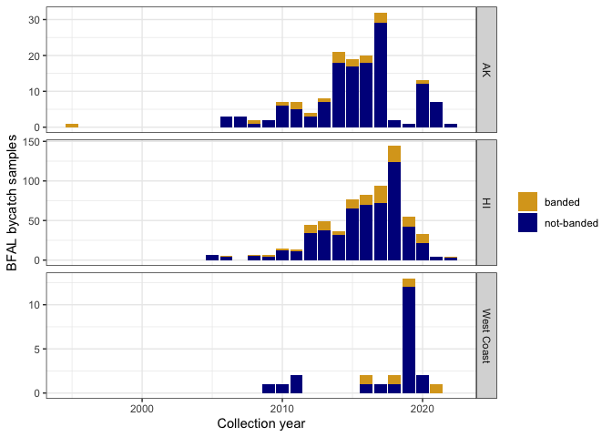
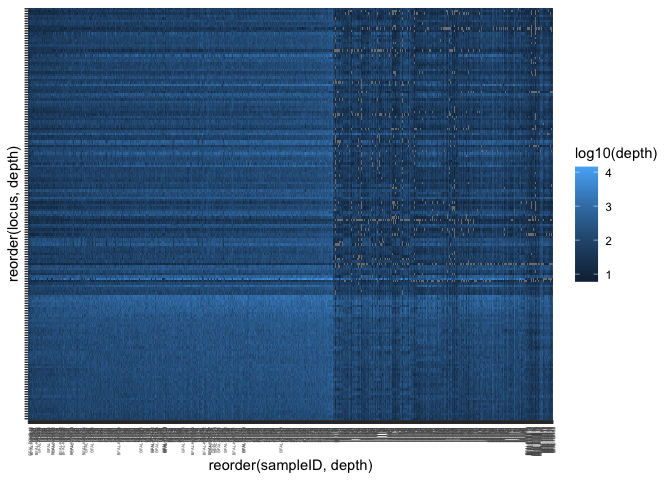
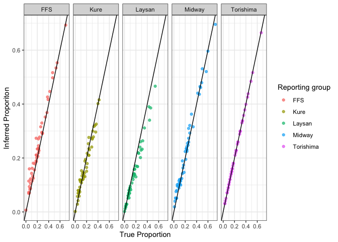
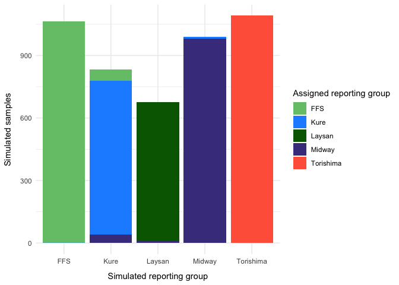
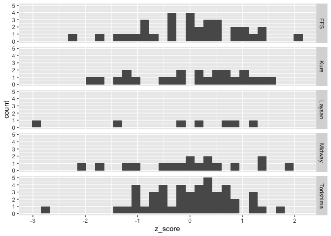
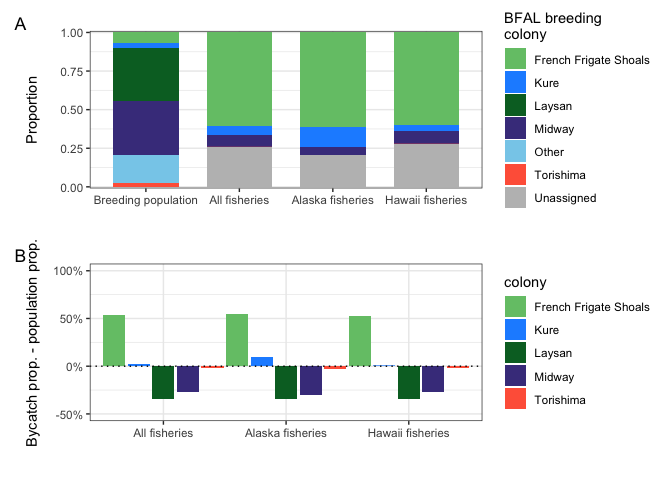

BFAL-GSI-analysis-and-manuscript-figures
================
diana baetscher
2023-12-20

19 December 2023

This is the full set of data and analyses used for the manuscript draft:
“Genetic assignment of Black-footed Albatross bycatch from U.S.
fisheries”

``` r
library(tidyverse)
```

    ## ── Attaching core tidyverse packages ──────────────────────── tidyverse 2.0.0 ──
    ## ✔ dplyr     1.1.3     ✔ readr     2.1.4
    ## ✔ forcats   1.0.0     ✔ stringr   1.5.0
    ## ✔ ggplot2   3.4.4     ✔ tibble    3.2.1
    ## ✔ lubridate 1.9.3     ✔ tidyr     1.3.0
    ## ✔ purrr     1.0.2     
    ## ── Conflicts ────────────────────────────────────────── tidyverse_conflicts() ──
    ## ✖ dplyr::filter() masks stats::filter()
    ## ✖ dplyr::lag()    masks stats::lag()
    ## ℹ Use the conflicted package (<http://conflicted.r-lib.org/>) to force all conflicts to become errors

``` r
library(readxl)
library(stringr)
library(lubridate)
library(rubias)
library(patchwork)
library(dplyr)


source("../R/rubias_MultChains.R")
```

    ## Loading required package: foreach
    ## 
    ## Attaching package: 'foreach'
    ## 
    ## The following objects are masked from 'package:purrr':
    ## 
    ##     accumulate, when
    ## 
    ## Loading required package: future
    ## Loading required package: rngtools

``` r
# latest, most complete version of the metadata!
meta_from_jessie <- read_csv("../data/BFAL_metadata_for_manuscript_noLatLon.csv")
```

    ## Rows: 855 Columns: 14
    ## ── Column specification ────────────────────────────────────────────────────────
    ## Delimiter: ","
    ## chr (9): sampleID, VerifySpecies, FisheriesName, GenCollArea, MinAgeCollecti...
    ## dbl (4): SBNDID, CollMonth, CollDay, CollYear
    ## lgl (1): BandY/N
    ## 
    ## ℹ Use `spec()` to retrieve the full column specification for this data.
    ## ℹ Specify the column types or set `show_col_types = FALSE` to quiet this message.

``` r
bycatch_metadata <- meta_from_jessie %>%
  mutate(sampleID = str_replace(sampleID, "008-", "08-"))

bycatch_metadata %>%
  group_by(`BandY/N`) %>%
  tally()
```

    ## # A tibble: 2 × 2
    ##   `BandY/N`     n
    ##   <lgl>     <int>
    ## 1 FALSE       704
    ## 2 TRUE        151

``` r
# numbers for Table 2.
bycatch_metadata %>%
  filter(CollYear >2009) %>% 
  group_by(FisheriesName, GenCollArea, `BandY/N`) %>%
  tally() 
```

    ## # A tibble: 10 × 4
    ## # Groups:   FisheriesName, GenCollArea [5]
    ##    FisheriesName                         GenCollArea `BandY/N`     n
    ##    <chr>                                 <chr>       <lgl>     <int>
    ##  1 Alaska Groundfish fisheries           AK          FALSE       126
    ##  2 Alaska Groundfish fisheries           AK          TRUE         16
    ##  3 At-Sea Hake Trawl                     WA          FALSE        20
    ##  4 At-Sea Hake Trawl                     WA          TRUE          4
    ##  5 Hawaii Deep-set Longline              HI          FALSE       432
    ##  6 Hawaii Deep-set Longline              HI          TRUE        105
    ##  7 Hawaii Longline Fisheries Unknown-Set HI          FALSE        43
    ##  8 Hawaii Longline Fisheries Unknown-Set HI          TRUE         11
    ##  9 Hawaii Shallow-set Longline           HI          FALSE        53
    ## 10 Hawaii Shallow-set Longline           HI          TRUE          8

``` r
# numbers for SI Figure 
bycatch_metadata %>%
  group_by(CollYear, GenCollArea, `BandY/N`) %>%
  tally() %>%
  dplyr::select(GenCollArea, CollYear, `BandY/N`, n) %>%
  mutate(`BandY/N` = ifelse(`BandY/N` == "TRUE", "banded", "not-banded")) %>%
  rename(BandStatus = `BandY/N`) %>%
  mutate(GenCollArea = ifelse(GenCollArea == "WA", "West Coast", GenCollArea)) %>%
  ggplot(aes(x = CollYear, y = n, fill = BandStatus)) +
  geom_bar(stat = "identity") +
  facet_grid(rows = vars(GenCollArea), scales = "free") +
  theme_bw() +
  labs(y = "BFAL bycatch samples",
       x = "Collection year",
       fill = "") +
  scale_fill_manual(values = c("goldenrod", "darkblue"))
```

<!-- -->

``` r
# read in samplesheet dataframe
all_samples_gtseq <- read_csv("../data/BFAL_gtseq_samplesheet_df.csv")
```

    ## Rows: 1044 Columns: 12
    ## ── Column specification ────────────────────────────────────────────────────────
    ## Delimiter: ","
    ## chr (11): sampleID, Sample_Plate, Sample_Well, I7_Index_ID, index, I5_Index_...
    ## lgl  (1): reference
    ## 
    ## ℹ Use `spec()` to retrieve the full column specification for this data.
    ## ℹ Specify the column types or set `show_col_types = FALSE` to quiet this message.

855 bycatch samples 704 not banded 151 banded

``` r
# remove the loci that had deviations from HWE in the majority of populations
loci_to_keep <- read_csv("../data/loci_to_keep_hwe.csv")
```

    ## Rows: 182 Columns: 1
    ## ── Column specification ────────────────────────────────────────────────────────
    ## Delimiter: ","
    ## chr (1): locus
    ## 
    ## ℹ Use `spec()` to retrieve the full column specification for this data.
    ## ℹ Specify the column types or set `show_col_types = FALSE` to quiet this message.

``` r
# read in rds file with genotypes
genos_NA_explicit <- read_rds("../data/processed/called_genos_na_explicit.rds") %>%
  inner_join(., loci_to_keep)
```

    ## Joining with `by = join_by(locus)`

``` r
# list of reference samples
genos_long <- genos_NA_explicit %>%
  left_join(., all_samples_gtseq) %>%
  dplyr::select(gtseq_run, id, locus, gene_copy, allele, depth, allele.balance, sampleID, pop, reference)
```

    ## Joining with `by = join_by(gtseq_run, id)`

## Some initial filters

### Take highest read-depth call for multiply-genotyped DNA_IDs

We know there are 83 duplicate samples.

Now, here is a harder operation: if an individual is multiply-genotyped,
take the genotype with the highest total read depth.

``` r
# slow-ish function to get the total read depth column
tdepth <- function(a, d) {
  if(any(is.na(a))) {
    return(NA)
  }
  if(a[1]==a[2]) {
    return(d[1])
  } else {
    return(d[1] + d[2])
  }
  
}
# this takes the highest read-depth instance of each duplicately-genotyped individual.
geno_one_each <- genos_long %>%
  group_by(sampleID, locus, gtseq_run, id) %>%
  mutate(total_depth = tdepth(allele, depth)) %>%
  ungroup() %>% 
  arrange(sampleID, locus, desc(total_depth), gtseq_run, depth) %>%
  group_by(sampleID, locus) %>%
  mutate(rank = 1:n()) %>% # this ranks all alleles for a given individual by depth
  ungroup() %>%
  filter(rank <= 2) # this takes the top ranked alleles and should remove duplicates

# use this df to eliminate issues with duplication
genos_no_dups <- geno_one_each %>%
  dplyr::select(-gtseq_run, -id, -total_depth, -rank) %>%
  filter(!is.na(sampleID)) # remove the sample with no sampleID
# this includes bycatch that was genotyped, but are not in the bycatch metadata because they are LAAL
```

## Locus evaluation

How many loci and how many alleles?

``` r
# alleles
genos_no_dups %>%
  filter(!is.na(allele)) %>%
  dplyr::select(locus, allele) %>%
  unique() %>%
  arrange(locus)
```

    ## # A tibble: 458 × 2
    ##    locus                allele
    ##    <chr>                <chr> 
    ##  1 scaffold_0_4543438   GAA   
    ##  2 scaffold_0_4543438   GGA   
    ##  3 scaffold_0_4543438   GGG   
    ##  4 scaffold_0_4543438   AGA   
    ##  5 scaffold_102_694013  T     
    ##  6 scaffold_102_694013  C     
    ##  7 scaffold_1050_36334  C     
    ##  8 scaffold_1050_36334  T     
    ##  9 scaffold_1053_177405 A     
    ## 10 scaffold_1053_177405 G     
    ## # ℹ 448 more rows

``` r
# loci
genos_no_dups %>%
  filter(!is.na(allele)) %>%
  dplyr::select(locus, allele) %>%
  unique() %>%
  group_by(locus) %>%
  tally() %>%
  arrange(desc(n))
```

    ## # A tibble: 182 × 2
    ##    locus                    n
    ##    <chr>                <int>
    ##  1 scaffold_1226_115783     8
    ##  2 scaffold_1589_18141      7
    ##  3 scaffold_1164_119437     6
    ##  4 scaffold_925_195188      6
    ##  5 scaffold_316_437138      5
    ##  6 scaffold_33_2811656      5
    ##  7 scaffold_343_778064      5
    ##  8 scaffold_48_3128896      5
    ##  9 scaffold_51_1220763      5
    ## 10 scaffold_0_4543438       4
    ## # ℹ 172 more rows

458 alleles across 182 loci with between 1-8 alleles per locus.

quick look at the loci with only 1 allele:

``` r
monomorphic <- genos_no_dups %>%
  filter(!is.na(allele)) %>%
  dplyr::select(locus, allele) %>%
  unique() %>%
  group_by(locus) %>%
  tally() %>%
  filter(n == 1) %>%
  left_join(., genos_no_dups) %>%
  dplyr::select(locus, allele) %>%
  unique() %>%
  filter(!is.na(allele)) %>%
  dplyr::select(locus)
```

    ## Joining with `by = join_by(locus)`

``` r
polymorphic_no_dups <- genos_no_dups %>%
  anti_join(., monomorphic)
```

    ## Joining with `by = join_by(locus)`

Missing data:

948 individuals \* 2 alleles per locus

50% missing data per locus = 948

``` r
# missing data across loci
locs_to_toss <- polymorphic_no_dups %>%
  group_by(locus) %>%
  mutate(missingness = ifelse(is.na(allele), 1, 0)) %>%
  summarise(sum(missingness)) %>% 
  filter(`sum(missingness)`>948) %>% # more than 50% missing data
  dplyr::select(locus) # drop those loci for now and see how the assignment goes

# just the keepers
genos_locs_filtered <- polymorphic_no_dups %>%
  anti_join(., locs_to_toss)
```

    ## Joining with `by = join_by(locus)`

Drop 3 loci with \> 50% missing data.

That brings the number of loci down to 168. (11 were monomorphic)

``` r
# summary of remaining loci
genos_locs_filtered %>%
  filter(!is.na(allele)) %>%
  dplyr::select(locus, allele) %>%
  unique()
```

    ## # A tibble: 437 × 2
    ##    locus                allele           
    ##    <chr>                <chr>            
    ##  1 scaffold_0_4543438   GAA              
    ##  2 scaffold_0_4543438   GGA              
    ##  3 scaffold_102_694013  T                
    ##  4 scaffold_1050_36334  C                
    ##  5 scaffold_1050_36334  T                
    ##  6 scaffold_1053_177405 A                
    ##  7 scaffold_1078_116737 GC               
    ##  8 scaffold_1078_116737 GT               
    ##  9 scaffold_10_1333563  A                
    ## 10 scaffold_1164_119437 TATTATACTAGTATTAG
    ## # ℹ 427 more rows

``` r
genos_locs_filtered %>%
  filter(!is.na(allele)) %>%
  dplyr::select(locus, allele) %>%
  unique() %>%
  group_by(locus) %>%
  tally() %>%
  arrange(desc(n))
```

    ## # A tibble: 168 × 2
    ##    locus                    n
    ##    <chr>                <int>
    ##  1 scaffold_1226_115783     8
    ##  2 scaffold_1589_18141      7
    ##  3 scaffold_1164_119437     6
    ##  4 scaffold_925_195188      6
    ##  5 scaffold_316_437138      5
    ##  6 scaffold_33_2811656      5
    ##  7 scaffold_343_778064      5
    ##  8 scaffold_51_1220763      5
    ##  9 scaffold_0_4543438       4
    ## 10 scaffold_127_1105814     4
    ## # ℹ 158 more rows

## Missing data in individuals

Total number of loci = 168

``` r
inds_to_toss <- genos_locs_filtered %>%
  group_by(sampleID) %>%
  mutate(missingness = ifelse(is.na(allele), 1, 0)) %>%
  summarise(sum(missingness)) %>%
  arrange(desc(`sum(missingness)`)) %>%
  filter(`sum(missingness)` > 85) # remove samples with >25% missing data

# just the keepers
genos_locs_ind_filtered <- genos_locs_filtered %>%
  anti_join(., inds_to_toss)
```

    ## Joining with `by = join_by(sampleID)`

64 samples had \>25% missing data But 13 of those samples are banded, so
that should mean only 51 drop-outs from the bycatch because of missing
data.

``` r
inds_to_toss %>%
  left_join(., bycatch_metadata) %>%
  dplyr::select(sampleID, `BandY/N`) %>%
  unique() %>%
  filter(`BandY/N` == T)
```

    ## Joining with `by = join_by(sampleID)`

    ## # A tibble: 13 × 2
    ##    sampleID `BandY/N`
    ##    <chr>    <lgl>    
    ##  1 17-0567  TRUE     
    ##  2 22-0366  TRUE     
    ##  3 15-0452  TRUE     
    ##  4 13-0991  TRUE     
    ##  5 14-0448  TRUE     
    ##  6 10-0233  TRUE     
    ##  7 13-0994  TRUE     
    ##  8 13-0540  TRUE     
    ##  9 22-0327  TRUE     
    ## 10 15-0326  TRUE     
    ## 11 14-0456  TRUE     
    ## 12 13-0538  TRUE     
    ## 13 12-0374  TRUE

``` r
genos_locs_ind_filtered  %>%
  ggplot(aes(y = reorder(locus, depth), x = reorder(sampleID, depth), fill = log10(depth))) +
  geom_tile() +
  theme(
    axis.text.y = element_blank(),
    axis.text.x = element_text(size = 3, angle = 90, hjust = .95)
  )
```

<!-- -->

## Leave-one-out assignment of source populations

Doing a sanity check with the reference baseline

``` r
# first make integers of the alleles
alle_idxs <- genos_locs_ind_filtered %>% 
  filter(!is.na(sampleID)) %>%
  dplyr::select(sampleID, locus, gene_copy, allele, pop, reference) %>%
  group_by(locus) %>%
  mutate(alleidx = as.integer(factor(allele, levels = unique(allele)))) %>%
  ungroup() %>%
  arrange(sampleID, locus, alleidx) # rubias can handle NA's, so no need to change them to 0's


## get the allele indexes for just the reference populations

# format for rubias
reference <- alle_idxs %>%
  filter(!is.na(reference)) %>%
  dplyr::select(-allele, -reference) %>%
  dplyr::select(pop, sampleID, everything()) %>%
  rename(collection = pop, indiv = sampleID)

# make two-col format
ref_two_col <- reference %>%
  unite("loc", 3:4, sep = ".") %>%
  pivot_wider(names_from = loc, values_from = alleidx) %>%
  mutate(repunit = collection) %>%
  mutate(sample_type = "reference") %>%
  dplyr::select(sample_type, repunit, collection, everything()) %>% # modify repunit info for Whale-Skate and Tern, which should be a single repunit for the French Frigate Shoals
  mutate(repunit = ifelse(collection %in% c("Tern", "Whale-Skate"), "FFS", repunit)) %>%
  filter(repunit != "Lehua") %>%
  filter(indiv != "21-0173") # remove the z-score outlier from the self-assignment (Laysan bird)
```

126 reference samples retained.

A little background here:

Rather than using self-assignment, I need to look at the leave-one-out
assessment because I know that doing self-assignment with my reference
being identical to my ascertainment samples is going to be upwardly
biased.

## Leave one out assessment for the baseline

``` r
loo_output <- rubias::assess_reference_loo(ref_two_col, gen_start_col = 5, return_indiv_posteriors = T)
```

    ## ++++ Starting in on repunit_scenario 1 with collection scenario 1 ++++

    ## Doing LOO simulations rep 1 of 50

    ## Warning: `as.tibble()` was deprecated in tibble 2.0.0.
    ## ℹ Please use `as_tibble()` instead.
    ## ℹ The signature and semantics have changed, see `?as_tibble`.
    ## ℹ The deprecated feature was likely used in the rubias package.
    ##   Please report the issue to the authors.
    ## This warning is displayed once every 8 hours.
    ## Call `lifecycle::last_lifecycle_warnings()` to see where this warning was
    ## generated.

    ## Doing LOO simulations rep 2 of 50

    ## Doing LOO simulations rep 3 of 50

    ## Doing LOO simulations rep 4 of 50

    ## Doing LOO simulations rep 5 of 50

    ## Doing LOO simulations rep 6 of 50

    ## Doing LOO simulations rep 7 of 50

    ## Doing LOO simulations rep 8 of 50

    ## Doing LOO simulations rep 9 of 50

    ## Doing LOO simulations rep 10 of 50

    ## Doing LOO simulations rep 11 of 50

    ## Doing LOO simulations rep 12 of 50

    ## Doing LOO simulations rep 13 of 50

    ## Doing LOO simulations rep 14 of 50

    ## Doing LOO simulations rep 15 of 50

    ## Doing LOO simulations rep 16 of 50

    ## Doing LOO simulations rep 17 of 50

    ## Doing LOO simulations rep 18 of 50

    ## Doing LOO simulations rep 19 of 50

    ## Doing LOO simulations rep 20 of 50

    ## Doing LOO simulations rep 21 of 50

    ## Doing LOO simulations rep 22 of 50

    ## Doing LOO simulations rep 23 of 50

    ## Doing LOO simulations rep 24 of 50

    ## Doing LOO simulations rep 25 of 50

    ## Doing LOO simulations rep 26 of 50

    ## Doing LOO simulations rep 27 of 50

    ## Doing LOO simulations rep 28 of 50

    ## Doing LOO simulations rep 29 of 50

    ## Doing LOO simulations rep 30 of 50

    ## Doing LOO simulations rep 31 of 50

    ## Doing LOO simulations rep 32 of 50

    ## Doing LOO simulations rep 33 of 50

    ## Doing LOO simulations rep 34 of 50

    ## Doing LOO simulations rep 35 of 50

    ## Doing LOO simulations rep 36 of 50

    ## Doing LOO simulations rep 37 of 50

    ## Doing LOO simulations rep 38 of 50

    ## Doing LOO simulations rep 39 of 50

    ## Doing LOO simulations rep 40 of 50

    ## Doing LOO simulations rep 41 of 50

    ## Doing LOO simulations rep 42 of 50

    ## Doing LOO simulations rep 43 of 50

    ## Doing LOO simulations rep 44 of 50

    ## Doing LOO simulations rep 45 of 50

    ## Doing LOO simulations rep 46 of 50

    ## Doing LOO simulations rep 47 of 50

    ## Doing LOO simulations rep 48 of 50

    ## Doing LOO simulations rep 49 of 50

    ## Doing LOO simulations rep 50 of 50

``` r
BFAL_resum<-loo_output$mixing_proportions %>%
  group_by(iter, repunit) %>%
  summarise(true_repprop = sum(true_pi), 
            reprop_posterior_mean = sum(post_mean_pi),
            repu_n = sum(n)) %>%
  mutate(repu_n_prop = repu_n / sum(repu_n))%>%
  mutate(Diff = reprop_posterior_mean - repu_n_prop)
```

    ## `summarise()` has grouped output by 'iter'. You can override using the
    ## `.groups` argument.

``` r
ggplot(BFAL_resum, aes(x = repu_n_prop, # Prop of ind. actually simulated 
                     y = reprop_posterior_mean, #inferred proportion
                     colour = repunit)) +
  geom_point(alpha = 0.7) +
  geom_abline(intercept = 0, slope = 1) +
  facet_grid(cols = vars(repunit)) +
  labs(y = "Inferred Proporiton",
       x = "True Proportion",
       color = "Reporting group")+
  theme_bw()
```

<!-- -->

``` r
#ggsave("pdf_outputs/LOO_simulated_proportions_group.pdf", width = 10, height = 5)
```

At the individual level…

``` r
# top p of z for each simulated individual
loo_top_pofz <- loo_output$indiv_posteriors %>%
  group_by(repunit_scenario, collection_scenario, iter, indiv, simulated_repunit, simulated_collection) %>%
  slice_max(., order_by = PofZ)


# plot individual posteriors for LOO
SI_fig2 <- loo_top_pofz %>%
  filter(PofZ > 0.90) %>%
  group_by(simulated_repunit, repunit) %>%
  ggplot(aes(x = simulated_repunit, fill = repunit)) +
  geom_bar(stat = "count", position = "stack") +
  theme_minimal() +
  labs(x = "Simulated reporting group",
       y = "Simulated samples",
       fill = "Assigned reporting group") +
  scale_fill_manual(values = c("#74c476", "dodgerblue", "darkgreen", "darkslateblue", "tomato")) +
  theme(
    axis.title.x = element_text(margin = margin(t=10)),
      axis.title.y = element_text(margin = margin(r = 10))
  )
  
SI_fig2
```

<!-- -->

``` r
#ggsave("pdf_outputs/LOO_indiv_posteriors90.png", width = 8, height = 5)
```

Summarize those results:

``` r
simulated <- loo_top_pofz %>%
  filter(PofZ > 0.90) %>%
  group_by(simulated_repunit) %>%
  tally(name = "total_per_repunit")


loo_top_pofz %>%
  filter(PofZ > 0.90) %>%
  group_by(simulated_repunit, repunit) %>%
  tally(name = "assigned_n") %>%
  mutate(correct = ifelse(simulated_repunit == repunit, "TRUE", "FALSE")) %>%
  left_join(., simulated, by = "simulated_repunit") %>%
  mutate(perc_correct = assigned_n/total_per_repunit)
```

    ## # A tibble: 10 × 6
    ## # Groups:   simulated_repunit [5]
    ##    simulated_repunit repunit   assigned_n correct total_per_repunit perc_correct
    ##    <chr>             <chr>          <int> <chr>               <int>        <dbl>
    ##  1 FFS               FFS             1063 TRUE                 1064     0.999   
    ##  2 FFS               Kure               1 FALSE                1064     0.000940
    ##  3 Kure              FFS               54 FALSE                 834     0.0647  
    ##  4 Kure              Kure             740 TRUE                  834     0.887   
    ##  5 Kure              Midway            40 FALSE                 834     0.0480  
    ##  6 Laysan            Laysan           669 TRUE                  677     0.988   
    ##  7 Laysan            Midway             8 FALSE                 677     0.0118  
    ##  8 Midway            Kure              10 FALSE                 990     0.0101  
    ##  9 Midway            Midway           980 TRUE                  990     0.990   
    ## 10 Torishima         Torishima       1091 TRUE                 1091     1

100% correct assignment to Torishima 99.9% correct assignment to FFS 99%
correct assignment to Midway 98.8% correct to Laysan 88.7% correct to
Kure

highest misassignments = 6.5% misassigned from Kure to FFS 4.8%
misassigned from Kure to Midway 1% misassigned from Midway to Kure and
from Laysan to Midway

#### self-assignment to generate z-score distributions

``` r
selfassigned <- rubias::self_assign(ref_two_col, gen_start_col = 5)
```

    ## Summary Statistics:
    ## 
    ## 126 Individuals in Sample
    ## 
    ## 168 Loci: scaffold_0_4543438.1, scaffold_1_5556176.2, scaffold_10_1333563.1, scaffold_102_694013.2, scaffold_1050_36334.2, scaffold_1053_177405.1, scaffold_1078_116737.1, scaffold_116_1932131.1, scaffold_116_386790.1, scaffold_1164_119437.1, scaffold_12_5002902.1, scaffold_121_565678.1, scaffold_1226_115783.1, scaffold_123_1115977.2, scaffold_127_1105814.1, scaffold_1327_103421.1, scaffold_14_2621198.1, scaffold_14_5075430.1, scaffold_140_259881.1, scaffold_143_1756997.1, scaffold_146_16700.1, scaffold_148_727111.1, scaffold_15_2923659.1, scaffold_15_5063205.1, scaffold_155_1707144.1, scaffold_155_468225.1, scaffold_157_815403.2, scaffold_1589_18141.1, scaffold_16_1050955.1, scaffold_16_1254862.1, scaffold_16_31673.1, scaffold_16_32172.1, scaffold_164_1134575.1, scaffold_166_410622.1, scaffold_177_673090.1, scaffold_184_724429.2, scaffold_184_734991.1, scaffold_185_1133045.2, scaffold_185_1154507.1, scaffold_190_1605668.1, scaffold_199_875998.1, scaffold_20_1133858.1, scaffold_204_1432955.1, scaffold_204_239685.1, scaffold_209_721065.2, scaffold_210_1478805.1, scaffold_214_606303.2, scaffold_224_319624.1, scaffold_227_1219626.1, scaffold_229_770334.1, scaffold_234_1146621.1, scaffold_237_341989.1, scaffold_238_668548.1, scaffold_24_1490422.1, scaffold_246_1244055.1, scaffold_246_31712.1, scaffold_247_950885.2, scaffold_249_340732.1, scaffold_253_684619.2, scaffold_256_454799.1, scaffold_27_1646617.1, scaffold_275_1006390.1, scaffold_28_4260845.1, scaffold_28_4262705.1, scaffold_284_808709.2, scaffold_286_314167.1, scaffold_287_423519.1, scaffold_29_3347800.1, scaffold_298_359540.1, scaffold_306_328368.1, scaffold_306_944429.2, scaffold_31_750839.1, scaffold_310_880276.1, scaffold_316_437138.1, scaffold_32_3673235.1, scaffold_32_803437.1, scaffold_32_811415.1, scaffold_324_135439.1, scaffold_33_2797456.1, scaffold_33_2811656.1, scaffold_335_662765.1, scaffold_336_143440.2, scaffold_34_2385714.1, scaffold_342_417561.1, scaffold_343_778064.1, scaffold_343_863766.1, scaffold_345_694649.1, scaffold_351_703875.1, scaffold_356_86112.1, scaffold_369_134745.1, scaffold_381_698673.1, scaffold_397_13764.1, scaffold_4_4005861.1, scaffold_40_612943.1, scaffold_41_907611.2, scaffold_411_530837.1, scaffold_417_428513.1, scaffold_429_778790.2, scaffold_437_192045.2, scaffold_45_3079339.1, scaffold_460_237213.1, scaffold_461_674999.1, scaffold_47_2495309.1, scaffold_472_10182.1, scaffold_487_133339.1, scaffold_491_362387.2, scaffold_491_382261.1, scaffold_5_697809.1, scaffold_500_214884.2, scaffold_51_1220763.2, scaffold_519_190199.2, scaffold_52_723164.1, scaffold_526_334093.1, scaffold_532_590089.1, scaffold_54_1630779.2, scaffold_547_47246.1, scaffold_55_2977720.1, scaffold_552_154281.1, scaffold_555_302525.1, scaffold_557_489027.1, scaffold_56_1290372.1, scaffold_565_253439.1, scaffold_57_1788671.2, scaffold_572_19499.1, scaffold_582_107987.1, scaffold_582_222480.1, scaffold_60_341016.1, scaffold_612_363793.1, scaffold_62_2806526.2, scaffold_621_290581.2, scaffold_633_500454.1, scaffold_64_2598599.1, scaffold_65_986791.1, scaffold_67_2416699.2, scaffold_670_51777.2, scaffold_684_229342.1, scaffold_691_412074.2, scaffold_694_285663.1, scaffold_698_186739.2, scaffold_7_15896.1, scaffold_7_4109482.1, scaffold_71_2209803.1, scaffold_72_1463271.1, scaffold_756_67966.1, scaffold_76_2683423.1, scaffold_760_180618.1, scaffold_768_353388.2, scaffold_774_111773.1, scaffold_786_264628.1, scaffold_793_76520.2, scaffold_8_4227715.1, scaffold_82_879210.1, scaffold_820_286874.1, scaffold_822_90287.2, scaffold_834_252344.1, scaffold_84_2655661.1, scaffold_854_86476.1, scaffold_857_326525.1, scaffold_869_275845.1, scaffold_88_684287.1, scaffold_9_4398937.1, scaffold_91_2132606.1, scaffold_925_195188.2, scaffold_94_1302246.1, scaffold_95_2059721.1, scaffold_958_223818.1, scaffold_97_1719991.1, scaffold_984_180851.2
    ## 
    ## 5 Reporting Units: Laysan, FFS, Midway, Kure, Torishima
    ## 
    ## 6 Collections: Laysan, Whale-Skate, Tern, Midway, Kure, Torishima
    ## 
    ## 1.19% of allelic data identified as missing

``` r
selfassigned %>%
  group_by(indiv) %>%
  slice_max(., order_by = scaled_likelihood) %>%
  ggplot(aes(x = z_score)) +
  geom_histogram() +
  facet_grid(rows = vars(repunit))
```

    ## `stat_bin()` using `bins = 30`. Pick better value with `binwidth`.

<!-- -->

``` r
# We don't have the ability to remove the ascertainment samples, so probably better to use the simulations instead.
selfass_nothresh <- selfassigned %>%
  group_by(indiv) %>%
  slice_max(., order_by = scaled_likelihood) %>%
  group_by(collection, inferred_collection) %>%
  tally(name = "no threshold")
  
selfass_90thresh <- selfassigned %>%
  group_by(indiv) %>%
  slice_max(., order_by = scaled_likelihood) %>%
  filter(scaled_likelihood >= 0.9) %>%
  group_by(collection, inferred_collection) %>%
  tally(name = "0.9 prob")

  
selfass_90thresh %>%
  left_join(., selfass_nothresh)
```

    ## Joining with `by = join_by(collection, inferred_collection)`

    ## # A tibble: 8 × 4
    ## # Groups:   collection [6]
    ##   collection  inferred_collection `0.9 prob` `no threshold`
    ##   <chr>       <chr>                    <int>          <int>
    ## 1 Kure        Kure                        19             20
    ## 2 Kure        Midway                       1              1
    ## 3 Kure        Tern                         2              2
    ## 4 Laysan      Laysan                       6              6
    ## 5 Midway      Midway                      15             15
    ## 6 Tern        Tern                        29             29
    ## 7 Torishima   Torishima                   46             46
    ## 8 Whale-Skate Whale-Skate                  3              3

Sample sizes:

``` r
ref_two_col %>%
  group_by(repunit) %>%
  tally() 
```

    ## # A tibble: 5 × 2
    ##   repunit       n
    ##   <chr>     <int>
    ## 1 FFS          33
    ## 2 Kure         23
    ## 3 Laysan        7
    ## 4 Midway       17
    ## 5 Torishima    46

## Mixture bycatch assignment

``` r
# format for rubias
mix_idx <- alle_idxs %>%
  anti_join(., ref_two_col, by = c("sampleID" = "indiv")) %>%
  dplyr::select(-allele, -pop, -reference) %>%
  mutate(collection = "bycatch") %>%
  rename(indiv = sampleID) %>%
  unique()

# confirming no duplicates that would prevent rubias from working
mix_idx %>%
  unite("loc", 2:3, sep = ".") %>%
  dplyr::group_by(indiv, collection, loc) %>%
    dplyr::summarise(n = dplyr::n(), .groups = "drop") %>%
    dplyr::filter(n > 1L)
```

    ## # A tibble: 0 × 4
    ## # ℹ 4 variables: indiv <chr>, collection <chr>, loc <chr>, n <int>

``` r
# make two-col format
mix_two_col <- mix_idx %>%
  arrange(indiv, locus, gene_copy) %>%
  unite("loc", 2:3, sep = ".") %>%
  pivot_wider(names_from = loc, values_from = alleidx) %>%
  mutate(repunit = NA) %>%
  mutate(sample_type = "mixture") %>%
  dplyr::select(sample_type, repunit, collection, everything())

# formatting for compatibility
tmp_combo <- bind_rows(ref_two_col, mix_two_col)

mix <- tmp_combo %>%
  filter(sample_type == "mixture")

ref <- tmp_combo %>%
  filter(sample_type == "reference")
```

``` r
# mixture analysis
bycatch_assign <- rubias::infer_mixture(reference = ref, mixture = mix, gen_start_col = 5)
```

    ## Collating data; compiling reference allele frequencies, etc.   time: 0.12 seconds
    ## Computing reference locus specific means and variances for computing mixture z-scores   time: 0.02 seconds
    ## Working on mixture collection: bycatch with 771 individuals
    ##   calculating log-likelihoods of the mixture individuals.   time: 0.02 seconds
    ##   performing 2000 total sweeps, 100 of which are burn-in and will not be used in computing averages in method "MCMC"   time: 0.06 seconds
    ##   tidying output into a tibble.   time: 0.02 seconds

``` r
mix_assigned <- bycatch_assign$indiv_posteriors %>%
  group_by(indiv) %>%
  slice_max(., order_by = PofZ)

# by repunit/collection
mix_assigned %>%
  group_by(repunit) %>%
  tally()
```

    ## # A tibble: 5 × 2
    ##   repunit       n
    ##   <chr>     <int>
    ## 1 FFS         581
    ## 2 Kure         84
    ## 3 Laysan       12
    ## 4 Midway       93
    ## 5 Torishima     1

771 birds in the GSI bycatch analysis.

#### investigate z-score outliers

``` r
# are there banded birds within the z-score outliers?
mix_assigned %>%
  filter(z_score < -3) %>%
  left_join(., bycatch_metadata, by = c("indiv" = "sampleID")) %>%
  filter(`BandY/N` == T)
```

    ## # A tibble: 3 × 23
    ## # Groups:   indiv [3]
    ##   mixture_collection indiv   repunit collection  PofZ log_likelihood z_score
    ##   <chr>              <chr>   <chr>   <chr>      <dbl>          <dbl>   <dbl>
    ## 1 bycatch            16-0378 FFS     Tern       0.990          -184.   -3.39
    ## 2 bycatch            21-0173 Laysan  Laysan     1              -265.  -10.2 
    ## 3 bycatch            21-0188 FFS     Tern       0.983          -183.   -3.04
    ## # ℹ 16 more variables: n_non_miss_loci <int>, n_miss_loci <int>,
    ## #   missing_loci <list>, SBNDID <dbl>, VerifySpecies <chr>,
    ## #   FisheriesName <chr>, GenCollArea <chr>, `BandY/N` <lgl>,
    ## #   MinAgeCollection <chr>, Location <chr>, `Loc-Abbr` <chr>, Sex <chr>,
    ## #   AgeEst <chr>, CollMonth <dbl>, CollDay <dbl>, CollYear <dbl>

``` r
# move the threshold to -3.5 to accommodate the known, banded birds.
mix_assigned %>%
  filter(z_score < -3.5)
```

    ## # A tibble: 18 × 10
    ## # Groups:   indiv [18]
    ##    mixture_collection indiv   repunit collection  PofZ log_likelihood z_score
    ##    <chr>              <chr>   <chr>   <chr>      <dbl>          <dbl>   <dbl>
    ##  1 bycatch            08-2150 Laysan  Laysan     1              -256.   -9.52
    ##  2 bycatch            11-0626 Laysan  Laysan     1              -253.   -8.86
    ##  3 bycatch            11-0628 Laysan  Laysan     1              -266.  -10.3 
    ##  4 bycatch            12-0369 Laysan  Laysan     1              -261.   -9.79
    ##  5 bycatch            13-0539 Laysan  Laysan     1              -257.  -10.0 
    ##  6 bycatch            13-0950 FFS     Tern       0.960          -180.   -4.61
    ##  7 bycatch            13-1186 Laysan  Laysan     1              -271.  -11.1 
    ##  8 bycatch            14-0548 FFS     Tern       0.531          -187.   -3.50
    ##  9 bycatch            14-0748 FFS     Tern       0.997          -191.   -4.24
    ## 10 bycatch            16-0412 Laysan  Laysan     1              -244.   -9.27
    ## 11 bycatch            16-0413 Laysan  Laysan     1              -255.   -9.82
    ## 12 bycatch            17-0320 Laysan  Laysan     1              -251.   -9.20
    ## 13 bycatch            18-0029 Laysan  Laysan     1              -261.  -10.2 
    ## 14 bycatch            19-0314 Laysan  Laysan     1              -267.  -10.6 
    ## 15 bycatch            19-0533 FFS     Tern       0.986          -181.   -3.66
    ## 16 bycatch            20-0359 FFS     Tern       0.962          -197.   -4.69
    ## 17 bycatch            20-0401 FFS     Tern       1.00           -189.   -3.69
    ## 18 bycatch            21-0173 Laysan  Laysan     1              -265.  -10.2 
    ## # ℹ 3 more variables: n_non_miss_loci <int>, n_miss_loci <int>,
    ## #   missing_loci <list>

``` r
# the only banded outlier is a Laysan bird, which matches our assumptions about banding and that colony
mix_assigned %>%
  filter(z_score < -3.5) %>%
  inner_join(., bycatch_metadata, by = c("indiv" = "sampleID")) %>%
  filter(`BandY/N` == F) %>%
  group_by(repunit)
```

    ## # A tibble: 8 × 23
    ## # Groups:   repunit [2]
    ##   mixture_collection indiv   repunit collection  PofZ log_likelihood z_score
    ##   <chr>              <chr>   <chr>   <chr>      <dbl>          <dbl>   <dbl>
    ## 1 bycatch            13-0539 Laysan  Laysan     1              -257.  -10.0 
    ## 2 bycatch            13-0950 FFS     Tern       0.960          -180.   -4.61
    ## 3 bycatch            14-0548 FFS     Tern       0.531          -187.   -3.50
    ## 4 bycatch            14-0748 FFS     Tern       0.997          -191.   -4.24
    ## 5 bycatch            18-0029 Laysan  Laysan     1              -261.  -10.2 
    ## 6 bycatch            19-0533 FFS     Tern       0.986          -181.   -3.66
    ## 7 bycatch            20-0359 FFS     Tern       0.962          -197.   -4.69
    ## 8 bycatch            20-0401 FFS     Tern       1.00           -189.   -3.69
    ## # ℹ 16 more variables: n_non_miss_loci <int>, n_miss_loci <int>,
    ## #   missing_loci <list>, SBNDID <dbl>, VerifySpecies <chr>,
    ## #   FisheriesName <chr>, GenCollArea <chr>, `BandY/N` <lgl>,
    ## #   MinAgeCollection <chr>, Location <chr>, `Loc-Abbr` <chr>, Sex <chr>,
    ## #   AgeEst <chr>, CollMonth <dbl>, CollDay <dbl>, CollYear <dbl>

#### assignment threshold

``` r
mix_assigned %>%
  filter(z_score > -3.5) %>%
  filter(PofZ > 0.9)
```

    ## # A tibble: 590 × 10
    ## # Groups:   indiv [590]
    ##    mixture_collection indiv   repunit collection  PofZ log_likelihood z_score
    ##    <chr>              <chr>   <chr>   <chr>      <dbl>          <dbl>   <dbl>
    ##  1 bycatch            08-1139 FFS     Tern       1.00           -169.  -1.68 
    ##  2 bycatch            08-1148 FFS     Tern       1.00           -160.  -0.424
    ##  3 bycatch            08-2152 FFS     Tern       0.911          -185.  -3.33 
    ##  4 bycatch            08-2174 FFS     Tern       0.936          -157.  -0.391
    ##  5 bycatch            08-2177 FFS     Tern       0.988          -164.  -1.17 
    ##  6 bycatch            09-0421 FFS     Tern       0.999          -155.  -0.618
    ##  7 bycatch            09-0422 FFS     Tern       1.00           -154.   0.263
    ##  8 bycatch            10-0212 FFS     Tern       1.00           -152.  -1.27 
    ##  9 bycatch            10-0217 FFS     Tern       0.991          -159.  -1.78 
    ## 10 bycatch            10-0226 FFS     Tern       1.00           -164.  -2.40 
    ## # ℹ 580 more rows
    ## # ℹ 3 more variables: n_non_miss_loci <int>, n_miss_loci <int>,
    ## #   missing_loci <list>

``` r
# assignments by colony
mix_assigned %>%
  filter(PofZ > 0.9 &
           z_score > -3.5) %>%
  group_by(repunit) %>%
  tally()
```

    ## # A tibble: 4 × 2
    ##   repunit       n
    ##   <chr>     <int>
    ## 1 FFS         483
    ## 2 Kure         44
    ## 3 Midway       62
    ## 4 Torishima     1

``` r
# unassigned
mix_assigned %>%
  filter(PofZ < 0.9) %>%
  group_by(repunit) %>%
  tally()
```

    ## # A tibble: 3 × 2
    ##   repunit     n
    ##   <chr>   <int>
    ## 1 FFS        93
    ## 2 Kure       40
    ## 3 Midway     31

``` r
mix_assigned %>%
  filter(z_score < -3.5) %>%
  left_join(., meta_from_jessie, by = c("indiv" = "sampleID"))
```

    ## # A tibble: 18 × 23
    ## # Groups:   indiv [18]
    ##    mixture_collection indiv   repunit collection  PofZ log_likelihood z_score
    ##    <chr>              <chr>   <chr>   <chr>      <dbl>          <dbl>   <dbl>
    ##  1 bycatch            08-2150 Laysan  Laysan     1              -256.   -9.52
    ##  2 bycatch            11-0626 Laysan  Laysan     1              -253.   -8.86
    ##  3 bycatch            11-0628 Laysan  Laysan     1              -266.  -10.3 
    ##  4 bycatch            12-0369 Laysan  Laysan     1              -261.   -9.79
    ##  5 bycatch            13-0539 Laysan  Laysan     1              -257.  -10.0 
    ##  6 bycatch            13-0950 FFS     Tern       0.960          -180.   -4.61
    ##  7 bycatch            13-1186 Laysan  Laysan     1              -271.  -11.1 
    ##  8 bycatch            14-0548 FFS     Tern       0.531          -187.   -3.50
    ##  9 bycatch            14-0748 FFS     Tern       0.997          -191.   -4.24
    ## 10 bycatch            16-0412 Laysan  Laysan     1              -244.   -9.27
    ## 11 bycatch            16-0413 Laysan  Laysan     1              -255.   -9.82
    ## 12 bycatch            17-0320 Laysan  Laysan     1              -251.   -9.20
    ## 13 bycatch            18-0029 Laysan  Laysan     1              -261.  -10.2 
    ## 14 bycatch            19-0314 Laysan  Laysan     1              -267.  -10.6 
    ## 15 bycatch            19-0533 FFS     Tern       0.986          -181.   -3.66
    ## 16 bycatch            20-0359 FFS     Tern       0.962          -197.   -4.69
    ## 17 bycatch            20-0401 FFS     Tern       1.00           -189.   -3.69
    ## 18 bycatch            21-0173 Laysan  Laysan     1              -265.  -10.2 
    ## # ℹ 16 more variables: n_non_miss_loci <int>, n_miss_loci <int>,
    ## #   missing_loci <list>, SBNDID <dbl>, VerifySpecies <chr>,
    ## #   FisheriesName <chr>, GenCollArea <chr>, `BandY/N` <lgl>,
    ## #   MinAgeCollection <chr>, Location <chr>, `Loc-Abbr` <chr>, Sex <chr>,
    ## #   AgeEst <chr>, CollMonth <dbl>, CollDay <dbl>, CollYear <dbl>

``` r
mix_assigned %>%
  filter(z_score > -3.5) %>%
  group_by(repunit) %>%
  add_tally(name = "no assignment threshold") %>%
  filter(PofZ > 0.5) %>%
  add_tally(name = "PofZ >0.5") %>%
  filter(PofZ > 0.9) %>%
  add_tally(name = "PofZ >0.9") %>%
  dplyr::select(repunit, `no assignment threshold`, `PofZ >0.5`, `PofZ >0.9`) %>%
  unique() #%>%
```

    ## # A tibble: 4 × 4
    ## # Groups:   repunit [4]
    ##   repunit   `no assignment threshold` `PofZ >0.5` `PofZ >0.9`
    ##   <chr>                         <int>       <int>       <int>
    ## 1 FFS                             575         574         483
    ## 2 Kure                             84          82          44
    ## 3 Midway                           93          90          62
    ## 4 Torishima                         1           1           1

``` r
  #write_csv("csv_outputs/gsi_assignments_SI_TableS2.csv")
```

``` r
# starting from the metadata df, 
# add the gsi assignments - including those that will get filtered out bec of PofZ and z-score
# and then account for the samples removed due to missing data filters
bycatch_meta_results <- bycatch_metadata %>%
  left_join(., mix_assigned, by = c("sampleID" = "indiv")) %>%
  left_join(., inds_to_toss) %>%
  mutate(n_miss_loci = ifelse(is.na(n_miss_loci), `sum(missingness)`, n_miss_loci)) %>%
  dplyr::select(-missing_loci, -`sum(missingness)`)
```

    ## Joining with `by = join_by(sampleID)`

``` r
bycatch_gsi_outputs <- bycatch_meta_results %>%
  mutate(note = ifelse(z_score < -3.5, "z_score outlier", NA)) %>%
  mutate(note = ifelse(PofZ < 0.9, "below PofZ threshold", note)) %>%
  mutate(note = ifelse(n_miss_loci > 84, "missing data", note)) %>%
  mutate(note = ifelse(`BandY/N` == T, "banded", note)) %>%
  mutate(colony = ifelse(is.na(note), repunit, note)) %>%
  mutate(colony = repunit) %>%
  #select(colony, note, repunit, `Loc-Abbr`, sampleID) %>%
  mutate(colony = ifelse(!is.na(`Loc-Abbr`), `Loc-Abbr`, colony)) %>%
  mutate(colony = str_replace(colony, "NWHI, ", ""))

bycatch_gsi_outputs
```

    ## # A tibble: 855 × 24
    ##    sampleID SBNDID VerifySpecies FisheriesName             GenCollArea `BandY/N`
    ##    <chr>     <dbl> <chr>         <chr>                     <chr>       <lgl>    
    ##  1 08-1139    3099 BFAL          Hawaii Deep-set Longline  HI          FALSE    
    ##  2 08-1140    3100 BFAL          Hawaii Shallow-set Longl… HI          TRUE     
    ##  3 08-1148    3108 BFAL          Hawaii Deep-set Longline  HI          FALSE    
    ##  4 08-1844    3267 BFAL          Hawaii Deep-set Longline  HI          FALSE    
    ##  5 08-2149    3279 BFAL          Alaska Groundfish fisher… AK          FALSE    
    ##  6 08-2152    3282 BFAL          Alaska Groundfish fisher… AK          FALSE    
    ##  7 08-2169    3299 BFAL          Hawaii Deep-set Longline  HI          FALSE    
    ##  8 08-2174    3304 BFAL          Hawaii Deep-set Longline  HI          FALSE    
    ##  9 08-2176    3306 BFAL          Hawaii Deep-set Longline  HI          TRUE     
    ## 10 08-2177    3307 BFAL          Hawaii Deep-set Longline  HI          FALSE    
    ## # ℹ 845 more rows
    ## # ℹ 18 more variables: MinAgeCollection <chr>, Location <chr>,
    ## #   `Loc-Abbr` <chr>, Sex <chr>, AgeEst <chr>, CollMonth <dbl>, CollDay <dbl>,
    ## #   CollYear <dbl>, mixture_collection <chr>, repunit <chr>, collection <chr>,
    ## #   PofZ <dbl>, log_likelihood <dbl>, z_score <dbl>, n_non_miss_loci <int>,
    ## #   n_miss_loci <dbl>, note <chr>, colony <chr>

``` r
# accounting
bands_w_loc <- bycatch_gsi_outputs %>%
  filter(note == "banded" & !is.na(`Loc-Abbr`))

bands_wo_loc_w_gsi <- bycatch_gsi_outputs %>%
  filter(note == "banded" & is.na(`Loc-Abbr`)) %>%
  filter(z_score > -3.5 & PofZ > 0.9)

not_banded_keepers <- bycatch_gsi_outputs %>%
  filter(`BandY/N` == F) %>%
  filter(n_miss_loci < 84) %>%
  filter(z_score > -3.5 & PofZ > 0.9)
  

# combine all retained samples with their band/GSI assignments
all_assignments <- bind_rows(not_banded_keepers, bands_w_loc, bands_wo_loc_w_gsi)

all_assignments %>%
  group_by(FisheriesName) %>%
  tally()
```

    ## # A tibble: 5 × 2
    ##   FisheriesName                             n
    ##   <chr>                                 <int>
    ## 1 Alaska Groundfish fisheries             122
    ## 2 At-Sea Hake Trawl                        21
    ## 3 Hawaii Deep-set Longline                431
    ## 4 Hawaii Longline Fisheries Unknown-Set    41
    ## 5 Hawaii Shallow-set Longline              51

``` r
colony_assignments <- bycatch_gsi_outputs %>%
  dplyr::select(-colony) %>%
  left_join(., all_assignments) %>%
  mutate(colony = ifelse(is.na(colony), "Unassigned", colony)) %>%
  filter(CollYear >2009) # filtering down to 2010-2022 dataset with 639 indivs.
```

    ## Joining with `by = join_by(sampleID, SBNDID, VerifySpecies, FisheriesName,
    ## GenCollArea, `BandY/N`, MinAgeCollection, Location, `Loc-Abbr`, Sex, AgeEst,
    ## CollMonth, CollDay, CollYear, mixture_collection, repunit, collection, PofZ,
    ## log_likelihood, z_score, n_non_miss_loci, n_miss_loci, note)`

``` r
# checking the number of samples removed by the year filter
bycatch_gsi_outputs %>%
  dplyr::select(-colony) %>%
  left_join(., all_assignments) %>%
  mutate(colony = ifelse(is.na(colony), "Unassigned", colony)) %>%
  anti_join(., colony_assignments) %>% # 37 birds removed because they were pre-2010.
  filter(note != "banded" & colony == "Unassigned") # 8 samples that were not banded that were not assigned 
```

    ## Joining with `by = join_by(sampleID, SBNDID, VerifySpecies, FisheriesName,
    ## GenCollArea, `BandY/N`, MinAgeCollection, Location, `Loc-Abbr`, Sex, AgeEst,
    ## CollMonth, CollDay, CollYear, mixture_collection, repunit, collection, PofZ,
    ## log_likelihood, z_score, n_non_miss_loci, n_miss_loci, note)`
    ## Joining with `by = join_by(sampleID, SBNDID, VerifySpecies, FisheriesName,
    ## GenCollArea, `BandY/N`, MinAgeCollection, Location, `Loc-Abbr`, Sex, AgeEst,
    ## CollMonth, CollDay, CollYear, mixture_collection, repunit, collection, PofZ,
    ## log_likelihood, z_score, n_non_miss_loci, n_miss_loci, note, colony)`

    ## # A tibble: 8 × 24
    ##   sampleID SBNDID VerifySpecies FisheriesName              GenCollArea `BandY/N`
    ##   <chr>     <dbl> <chr>         <chr>                      <chr>       <lgl>    
    ## 1 08-1844    3267 BFAL          Hawaii Deep-set Longline   HI          FALSE    
    ## 2 08-2149    3279 BFAL          Alaska Groundfish fisheri… AK          FALSE    
    ## 3 08-2169    3299 BFAL          Hawaii Deep-set Longline   HI          FALSE    
    ## 4 10-0230    3396 BFAL          Hawaii Deep-set Longline   HI          FALSE    
    ## 5 10-0462    3562 BFAL          Hawaii Shallow-set Longli… HI          FALSE    
    ## 6 10-0585    3682 BFAL          Hawaii Deep-set Longline   HI          FALSE    
    ## 7 10-0628    3721 BFAL          Alaska Groundfish fisheri… AK          FALSE    
    ## 8 10-0678    3770 BFAL          Hawaii Deep-set Longline   HI          FALSE    
    ## # ℹ 18 more variables: MinAgeCollection <chr>, Location <chr>,
    ## #   `Loc-Abbr` <chr>, Sex <chr>, AgeEst <chr>, CollMonth <dbl>, CollDay <dbl>,
    ## #   CollYear <dbl>, mixture_collection <chr>, repunit <chr>, collection <chr>,
    ## #   PofZ <dbl>, log_likelihood <dbl>, z_score <dbl>, n_non_miss_loci <int>,
    ## #   n_miss_loci <dbl>, note <chr>, colony <chr>

``` r
# confirming the number of unassigned samples post-2010
colony_assignments %>%
   filter(note != "banded" & colony == "Unassigned")
```

    ## # A tibble: 177 × 24
    ##    sampleID SBNDID VerifySpecies FisheriesName             GenCollArea `BandY/N`
    ##    <chr>     <dbl> <chr>         <chr>                     <chr>       <lgl>    
    ##  1 10-0228    3394 BFAL          Hawaii Deep-set Longline  HI          FALSE    
    ##  2 10-0495    3595 BFAL          Hawaii Shallow-set Longl… HI          FALSE    
    ##  3 11-0608    4103 BFAL          Hawaii Deep-set Longline  HI          FALSE    
    ##  4 11-0614    4109 BFAL          Hawaii Shallow-set Longl… HI          FALSE    
    ##  5 11-0705    4187 BFAL          Hawaii Deep-set Longline  HI          FALSE    
    ##  6 12-0145    4439 BFAL          Alaska Groundfish fisher… AK          FALSE    
    ##  7 12-0239    4454 BFAL          Hawaii Deep-set Longline  HI          FALSE    
    ##  8 12-0244    4459 BFAL          Hawaii Shallow-set Longl… HI          FALSE    
    ##  9 12-0261    4476 BFAL          Hawaii Deep-set Longline  HI          FALSE    
    ## 10 12-0264    4479 BFAL          Hawaii Deep-set Longline  HI          FALSE    
    ## # ℹ 167 more rows
    ## # ℹ 18 more variables: MinAgeCollection <chr>, Location <chr>,
    ## #   `Loc-Abbr` <chr>, Sex <chr>, AgeEst <chr>, CollMonth <dbl>, CollDay <dbl>,
    ## #   CollYear <dbl>, mixture_collection <chr>, repunit <chr>, collection <chr>,
    ## #   PofZ <dbl>, log_likelihood <dbl>, z_score <dbl>, n_non_miss_loci <int>,
    ## #   n_miss_loci <dbl>, note <chr>, colony <chr>

``` r
# data for table 2 using just data from 2010+
colony_assignments %>%
  mutate(colony = ifelse(colony %in% c("Kauai, Kilauea", "Kauai, Lehua", "Oahu"), "Other", colony)) %>%
  group_by(FisheriesName, colony) %>%
  group_by(colony) %>%
  tally() 
```

    ## # A tibble: 7 × 2
    ##   colony         n
    ##   <chr>      <int>
    ## 1 FFS          519
    ## 2 Kure          46
    ## 3 Laysan        11
    ## 4 Midway        57
    ## 5 Other          5
    ## 6 Torishima      1
    ## 7 Unassigned   179

177 samples that were not banded and not assigned by GSI. 179 samples
that were not assigned by GSI (including two that were banded)

### HERE REMOVE ALL HAWAIIAN FISHERIES BANDED BIRDS.

All banded birds are collected in HI fisheries, which creates bias
because banding is not consistent across breeding colonies.

``` r
hi_banded_to_remove <- colony_assignments %>%
  filter(str_detect(FisheriesName, "Hawaii") & `BandY/N` == T)

# account for those in Table 3
hi_banded_to_remove %>%
  group_by(Location) %>%
  tally()
```

    ## # A tibble: 8 × 2
    ##   Location                                              n
    ##   <chr>                                             <int>
    ## 1 French Frigate Shoals                                97
    ## 2 Green Island, Kure Atoll, Honolulu County, Hawaii     6
    ## 3 Laysan Island, Honolulu County, Hawaii               11
    ## 4 Lehua Island, Kauai, Kauai County, HI                 2
    ## 5 Midway Atoll                                          1
    ## 6 Near Kilauea Point, Kauai County, HI                  1
    ## 7 Oahu                                                  2
    ## 8 <NA>                                                  4

``` r
assignments_no_hi_banded <- colony_assignments %>%
  anti_join(., hi_banded_to_remove)
```

    ## Joining with `by = join_by(sampleID, SBNDID, VerifySpecies, FisheriesName,
    ## GenCollArea, `BandY/N`, MinAgeCollection, Location, `Loc-Abbr`, Sex, AgeEst,
    ## CollMonth, CollDay, CollYear, mixture_collection, repunit, collection, PofZ,
    ## log_likelihood, z_score, n_non_miss_loci, n_miss_loci, note, colony)`

``` r
# summarize for Table 3
assignments_no_hi_banded %>%
  group_by(GenCollArea, colony) %>%
  tally() %>%
  arrange(GenCollArea, colony)
```

    ## # A tibble: 12 × 3
    ## # Groups:   GenCollArea [3]
    ##    GenCollArea colony         n
    ##    <chr>       <chr>      <int>
    ##  1 AK          FFS           87
    ##  2 AK          Kure          18
    ##  3 AK          Midway         8
    ##  4 AK          Unassigned    29
    ##  5 HI          FFS          315
    ##  6 HI          Kure          21
    ##  7 HI          Midway        46
    ##  8 HI          Torishima      1
    ##  9 HI          Unassigned   145
    ## 10 WA          FFS           18
    ## 11 WA          Midway         2
    ## 12 WA          Unassigned     4

``` r
# all fisheries
assignments_no_hi_banded %>%
  group_by(colony) %>%
  tally() %>%
  filter(colony != "Unassigned") %>%
  summarise(sum(n))
```

    ## # A tibble: 1 × 1
    ##   `sum(n)`
    ##      <int>
    ## 1      516

Remove 124 banded birds that were caught in HI fisheries.

### Using that GSI/band location output for figures

``` r
# set colors
mypalette <- c("dodgerblue", "#006d2c", "skyblue", "darkslateblue", "#74c476",  # Hawaii - greens, blues
               "tomato", "#31a354") # Japan - red
```

``` r
pop_est <- read_csv("../data/bfal_pop_estimates.csv")
```

    ## Rows: 8 Columns: 3
    ## ── Column specification ────────────────────────────────────────────────────────
    ## Delimiter: ","
    ## chr (2): colony, colony_abbr
    ## num (1): population_estimate
    ## 
    ## ℹ Use `spec()` to retrieve the full column specification for this data.
    ## ℹ Specify the column types or set `show_col_types = FALSE` to quiet this message.

``` r
prop_total_pop <- pop_est %>%
  filter(colony != "Total") %>%
  mutate(total_pop = sum(population_estimate)) %>%
  mutate(perc_of_total = population_estimate/total_pop) %>%
  mutate(GenCollArea = "Breeding population") %>%
  mutate(colony = colony_abbr) # fix this once we figure out what's needed for Lehua
```

Make barplot based on population proportions

``` r
final_bycatch_prop <- assignments_no_hi_banded %>%
  group_by(colony, GenCollArea) %>%
  mutate(colony = ifelse(colony %in% c("Kauai, Kilauea", "Kauai, Lehua", "Oahu"), "Other", colony)) %>%
  tally() %>%
  arrange(GenCollArea) %>%
  ungroup() %>%
  group_by(GenCollArea) %>%
  mutate(area_bycatch = sum(n)) %>%
  group_by(colony, GenCollArea) %>%
  mutate(col_bycatch_region = sum(n)) %>%
  mutate(col_bycatch_region_prop = col_bycatch_region/area_bycatch) %>%
  # calculate the bycatch proportions for all fisheries combined
  ungroup() %>%
  mutate(total_bycatch = sum(n)) %>%
  group_by(colony) %>%
  mutate(colony_total = sum(n)) %>%
  mutate(perc_of_total = colony_total/total_bycatch) %>%
  ungroup() 
  
all_fish_data <- final_bycatch_prop %>%
  dplyr::select(colony, perc_of_total) %>%
  mutate(GenCollArea = "All fisheries") %>%
  unique()

# add in proportion of total population
prop_total_pop %>%
  left_join(., final_bycatch_prop, by = c("colony_abbr" = "colony")) 
```

    ## # A tibble: 12 × 14
    ##    colony    population_estimate colony_abbr total_pop perc_of_total.x
    ##    <chr>                   <dbl> <chr>           <dbl>           <dbl>
    ##  1 Kure                     4040 Kure           123362        0.0327  
    ##  2 Kure                     4040 Kure           123362        0.0327  
    ##  3 Midway                  43658 Midway         123362        0.354   
    ##  4 Midway                  43658 Midway         123362        0.354   
    ##  5 Midway                  43658 Midway         123362        0.354   
    ##  6 Laysan                  42012 Laysan         123362        0.341   
    ##  7 FFS                      8518 FFS            123362        0.0690  
    ##  8 FFS                      8518 FFS            123362        0.0690  
    ##  9 FFS                      8518 FFS            123362        0.0690  
    ## 10 <NA>                       20 <NA>           123362        0.000162
    ## 11 Torishima                3120 Torishima      123362        0.0253  
    ## 12 Other                   21994 Other          123362        0.178   
    ## # ℹ 9 more variables: GenCollArea.x <chr>, GenCollArea.y <chr>, n <int>,
    ## #   area_bycatch <int>, col_bycatch_region <int>,
    ## #   col_bycatch_region_prop <dbl>, total_bycatch <int>, colony_total <int>,
    ## #   perc_of_total.y <dbl>

``` r
combined_prop_df <- final_bycatch_prop %>%
  bind_rows(., prop_total_pop) %>%
  bind_rows(all_fish_data) %>%
  mutate(col_bycatch_region_prop = ifelse(is.na(col_bycatch_region_prop), perc_of_total, col_bycatch_region_prop)) %>%
  filter(!is.na(colony),
         GenCollArea != "WA") %>%
  mutate(GenCollArea = ifelse(GenCollArea == "AK", "Alaska fisheries", GenCollArea)) %>%
    mutate(GenCollArea = ifelse(GenCollArea == "HI", "Hawaii fisheries", GenCollArea))
```

Remove WA (low sample sizes) Add all fisheries combined (including WA)

``` r
area_order <- combined_prop_df$GenCollArea <- factor(combined_prop_df$GenCollArea, levels=c("Breeding population", "All fisheries", "Alaska fisheries", "Hawaii fisheries"))

bycatchA <- combined_prop_df %>%
  mutate(colony = ifelse(colony == "FFS", "French Frigate Shoals", colony)) %>%
  ggplot(aes(x = GenCollArea, y = col_bycatch_region_prop, fill = colony)) +
  geom_bar(stat = "identity", position = "stack", width = 0.7) +
  theme_bw() +
  labs(
    fill = "BFAL breeding \ncolony",
    y = "Proportion",
    x = " "
  ) +
  scale_y_continuous(limits = c(0, 1), expand = c(0,0.01)) +
  scale_fill_manual(values = c("#74c476", "dodgerblue", "#006d2c", "darkslateblue", "skyblue", "tomato", "gray")) +
  theme(
    axis.title.x = element_text(margin = margin(t=10)),
      axis.title.y = element_text(margin = margin(r = 10))

  )

#ggsave("pdf_outputs/colony_bycatch_barplot.png", width = 7, height = 4)
```

Alternative plot with differences between the population and the
fisheries:

``` r
# because I had to futz with the dataframe earlier, there are odds and ends out of place
bycatch_diff <- combined_prop_df %>%
  mutate(colony = ifelse(colony == "FFS", "French Frigate Shoals", colony)) %>%
  dplyr::select(colony, GenCollArea, col_bycatch_region_prop) %>%
  pivot_wider(names_from = "GenCollArea", values_from = col_bycatch_region_prop) %>%
  pivot_longer(cols = c(`All fisheries`, `Alaska fisheries`, `Hawaii fisheries`), names_to = "fishery", values_to = "prop_bycatch") %>%
  mutate(prop_bycatch = ifelse(is.na(prop_bycatch), 0, prop_bycatch)) %>%
  mutate(perc_diff = (prop_bycatch-`Breeding population`)*100) %>%
  filter(!is.na(perc_diff)) 
# reorder the factor
bycatch_diff$fishery <- factor(bycatch_diff$fishery, levels= c("All fisheries", "Alaska fisheries", "Hawaii fisheries"))
bycatch_diff$colony <- factor(bycatch_diff$colony, levels = c("French Frigate Shoals", "Kure", "Laysan", "Midway", "Torishima", 
                                                              "Other"))

bycatchB <- bycatch_diff %>%
  filter(colony != "Other") %>% # this is misrepresented since the unassigned is also probably part of this.
  ggplot(aes(x = fishery, y = perc_diff, fill = colony)) +
  #geom_point(size = 3) +
  geom_bar(stat = "identity", position = position_dodge2(preserve = "single"), width = 1) +
  geom_hline(yintercept = 0, col = "black", linetype = "dotted") +
   theme_bw() +
  labs(
    color = "Bycatch \ncolony of origin",
    y = "Bycatch prop. - population prop.",
    x = " "
  ) +
  #scale_y_continuous(limits = c(0, 1), expand = c(0,0)) +
  scale_fill_manual(values = c("#74c476", "dodgerblue", "#006d2c", "darkslateblue", "tomato", "skyblue")) +
  theme(
    axis.title.x = element_text(margin = margin(t=10)),
      axis.title.y = element_text(margin = margin(r = 10))

  ) +
  scale_y_continuous(limits = c(-50, 100), labels = c("-50%", "0%", "50%", "100%"))

#ggsave("pdf_outputs/colony_bycatch_diff_plot.png", width = 6, height = 3.5)
```

``` r
bycatchA + bycatchB + plot_annotation(tag_levels = "A") + plot_layout(ncol = 1)
```

<!-- -->

``` r
#ggsave("pdf_outputs/colony_bycatch_diff_plot_2panel.png", width = 7, height = 6.5)
```

# Spatial analysis

## Spatial analysis with utilization distributions

Because of confidentiality rules around fisheries information, the
lat/lon data cannot be made public in this repository. Thus, this code
will not run it its present form.

``` r
#load packages (could probably remove some of these - calling in a bunch just in case)
# library(tidyverse)
# library(adehabitatHR)
# library(ggplot2)
# library(magrittr)
# library(sp)
# library(sf)
# library(raster)
# library(rgdal)
# library(mapdata)
# library(dplyr)
# 
# # confirm sample numbers
# bfal <- assignments_no_hi_banded %>%
#   filter(colony != "Unassigned" &
#            !is.na(SLatDD)) %>%
#   rename(long = SLongDD, lat = SLatDD)
# 
# bfal$colony <- factor(bfal$colony, levels = c("FFS", "Kure", "Midway"), 
#                   labels = c("FFS (400)", "Kure (39)", "Midway (56)"))
# 
# bfal$long360=ifelse(bfal$long < 0,bfal$long + 360, bfal$long)
# 
# #colony locations
# colony_locs <- read_csv("../data/latlon_df.csv")
```

``` r
#summarize to double check
# bfal %>% group_by(colony) %>% 
#   tally()
# 
# # there are 619 birds at this stage, AK, HI, and WA combined
# # only includes birds with band data or GSI with PofZ >=.9, and must have spatial data
# 
# # test plot
# plot(bfal$long360, bfal$lat, asp = 1)
# 
# bfal %>%
#   dplyr::select(sampleID, lat, long, long360)
# 
# points = st_as_sf(bfal, coords = c("long360", "lat"), crs = 4326)
# plot(st_geometry(points), pch=1, col="navy")
# 
# # make kernels
# 
# # Make a spatial points data.frame (SPDF)
# spdf <- SpatialPointsDataFrame(coords=cbind(bfal$long,
#   # bfal$long360,
#                                             bfal$lat),
#                                data=data.frame(id=bfal$colony),
#                                proj4string = CRS("+proj=longlat +ellps=WGS84 +datum=WGS84 +no_defs +wrap_lon=180"))
# 
# # Project data into laea
# spdf.t <- spTransform(spdf,
#                       # CRS("+proj=aea +lat_1=55 +lat_2=65 +lat_0=50 +lon_0=-154")
#                       CRS("+proj=aea +lat_1=30 +lat_2=70 +lat_0=52 +lon_0=-170 +x_0=0 +y_0=0 +ellps=GRS80 +datum=NAD83 +units=m +no_defs") #https://spatialreference.org/ref/sr-org/north-pacific-albers-conic-equal-area/
#                       ) ## this projection might be wrong - check with Jon?
# 
# # calculate kernelUD
# #jb try to up h factor and see what happens (more smoothing) ## get more details from Jon on the smoothing factor
# ud <- kernelUD(spdf.t, 
#                h = 100000,
#                # h="href",
#                # h=200000, #200km; 100km as used previously seemed a bit small, but if you want more detail and independent ud50 blobs maybe go back to 100km
#                grid=200, #
#                same4all=TRUE #the default for this is FALSE but I think you might want to calc the UDs for each ID (colony) over the same extent
#                )
# ud90 <- getverticeshr(ud, percent=90, standardize=T)
# ud50 <- getverticeshr(ud, percent=50, standardize=T)
# 
# ud50sf<-st_as_sf(ud50) #I am just keeping these separate
# ud90sf<-st_as_sf(ud90)
# 
# world <-st_crop(st_transform(st_as_sf(maps::map("world", plot = FALSE, fill = TRUE)), 
#                              st_crs(ud90sf)),
#                              1.15*st_bbox(ud90sf)) %>% #crop to just beyond extent of ud90
#   filter(ID!="Antarctica")
# 
# p3 <-ggplot() + 
#   geom_sf(data=ud90sf, aes(fill=id), alpha=0.2) +
#   geom_sf(data=ud50sf, aes(fill=id), alpha=0.8) + 
#   geom_sf(data=world, fill="gray30",color=NA) +
#   facet_wrap(~id) +
#   labs(fill = "UD by \ncolony",
#        x = "",
#        y = "")+
#   theme_bw() +
#   scale_x_continuous(breaks = c(-175, -155, -135), labels = c("175˚W", "155˚W", "135˚W"), expand = c(0,0)) +
#   scale_y_continuous(expand = c(0,0)) +
#   theme(legend.position = "none") +
#   scale_fill_manual(values = c("#74c476", "dodgerblue", "slateblue")) +
#   theme(
#     axis.text.x = element_text(size = 7),
#     axis.text.y = element_text(size = 7)
#   ) 
# 
# p3 

# ggsave(plot=p3,"pdf_outputs/BFAL_UDs_3panels_495birds.png", width = 8, height = 4)
# bring that output into Inkscape for adding UD% notes
```
