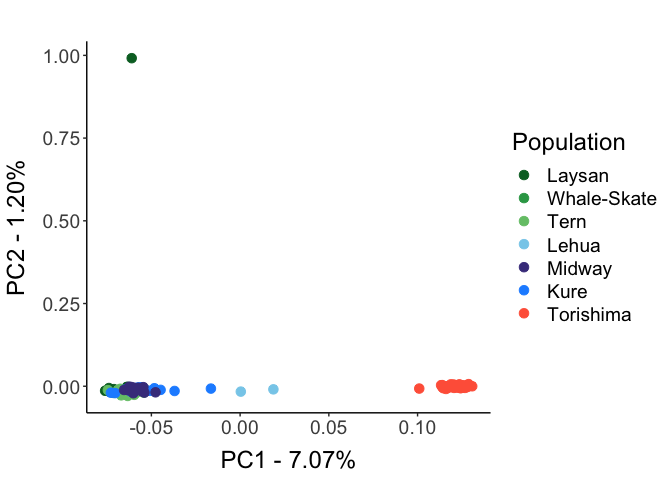
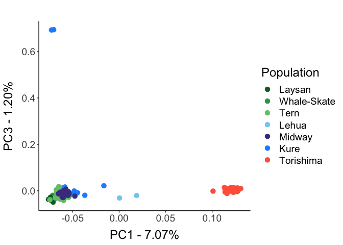
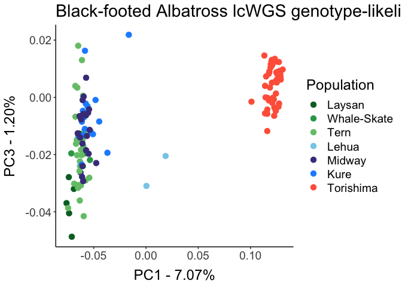
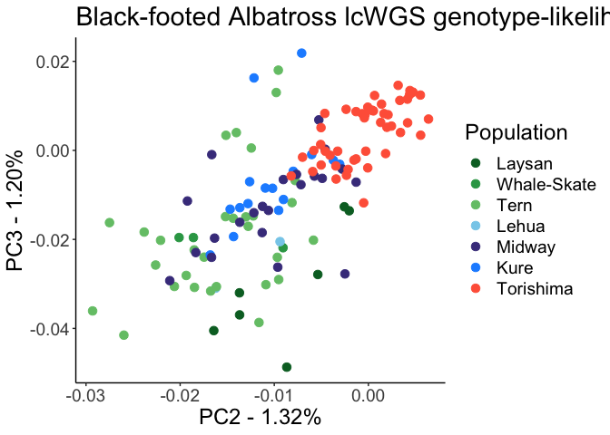
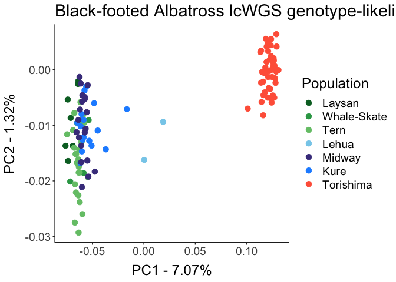
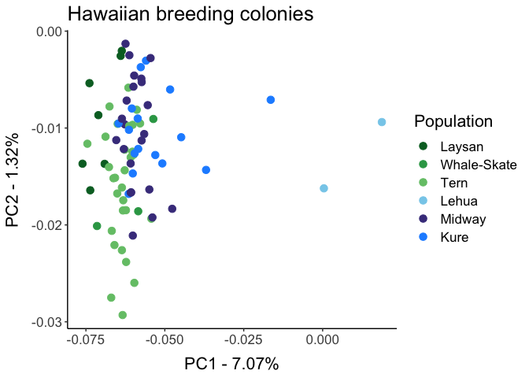
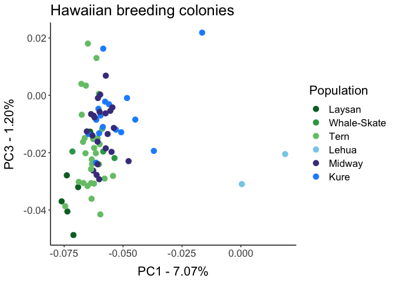
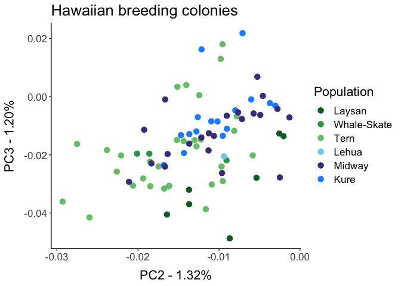

lcWGS-PCA-analysis
================
Diana Baetscher
2022-08-23

23 August 2022

Following the tutorial from
<http://www.popgen.dk/software/index.php/PCAngsdTutorial#Plot_the_results_in_R>

``` r
######################################
### INSTALL PACKAGES & LOAD FUNCTIONS
packages_needed <- c("ggplot2", "plotly", "ggpubr", "tidyverse")

for(i in 1:length(packages_needed)){
  if(!(packages_needed[i] %in% installed.packages())){install.packages(packages_needed[i])}
  library(packages_needed[i], character.only = TRUE)
}
```

    ## 
    ## Attaching package: 'plotly'

    ## The following object is masked from 'package:ggplot2':
    ## 
    ##     last_plot

    ## The following object is masked from 'package:stats':
    ## 
    ##     filter

    ## The following object is masked from 'package:graphics':
    ## 
    ##     layout

    ## ── Attaching core tidyverse packages ──────────────────────── tidyverse 2.0.0 ──
    ## ✔ dplyr     1.1.3     ✔ readr     2.1.4
    ## ✔ forcats   1.0.0     ✔ stringr   1.5.0
    ## ✔ lubridate 1.9.3     ✔ tibble    3.2.1
    ## ✔ purrr     1.0.2     ✔ tidyr     1.3.0
    ## ── Conflicts ────────────────────────────────────────── tidyverse_conflicts() ──
    ## ✖ dplyr::filter() masks plotly::filter(), stats::filter()
    ## ✖ dplyr::lag()    masks stats::lag()
    ## ℹ Use the conflicted package (<http://conflicted.r-lib.org/>) to force all conflicts to become errors

``` r
g_legend <- function(myggplot){
  tmp <- ggplot_gtable(ggplot_build(myggplot))
  leg <- which(sapply(tmp$grobs, function(x) x$name) == "guide-box")
  legend <- tmp$grobs[[leg]]
  return(legend)
}
######################################
```

``` r
######################################
## DIRECTORIES AND FILE NAMES
DATADIR <- "../data/lcWGS_data/"
BAM_LIST <- "BFAL_filtered_bamslist.txt"
SAMPLEMETADATA <- "BFALsamplePops.csv"
#METADATA <- "fst_meta_data.txt"
######################################
```

``` r
######################################
## Data for Plotting

seq_samples_nodups <- read.delim(paste0(DATADIR,SAMPLEMETADATA), header = TRUE, sep = ",")
head(seq_samples_nodups)
```

    ##   sampleID         pop
    ## 1 B12-0270      Laysan
    ## 2 B12-0271 Whale-Skate
    ## 3 B12-0371 Whale-Skate
    ## 4 B12-0372 Whale-Skate
    ## 5 B12-0381      Laysan
    ## 6 B15-0131      Laysan

``` r
#plotData <- left_join(sampleIDs_df, seq_samples_nodups, by = c("V1" = "PreviousSampleName"))
#dim(plotData)

# how many pops?
unique(seq_samples_nodups$pop)
```

    ## [1] "Laysan"      "Whale-Skate" "Tern"        "Lehua"       "Midway"     
    ## [6] "Kure"        "Torishima"

``` r
pop.factor.levels <- c("Laysan", "Whale-Skate", "Tern", 
                       "Lehua", "Midway", "Kure", "Torishima")


mypalette <- c("#006d2c", "#31a354", "#74c476",  "skyblue", "darkslateblue", "dodgerblue", # Hawaii - greens, blues
               "tomato") # Japan - red

######################################
```

Need to filter out the blacklisted indivs

``` r
# read in indvs to remove
to_remove <- read_tsv("../data/lcWGS_data/BFAL_blacklist_1x.txt", col_names = F) %>%
  rename(sampleID = X1)
```

    ## Rows: 7 Columns: 1
    ## ── Column specification ────────────────────────────────────────────────────────
    ## Delimiter: "\t"
    ## chr (1): X1
    ## 
    ## ℹ Use `spec()` to retrieve the full column specification for this data.
    ## ℹ Specify the column types or set `show_col_types = FALSE` to quiet this message.

``` r
head(to_remove)
```

    ## # A tibble: 6 × 1
    ##   sampleID    
    ##   <chr>       
    ## 1 BFAL-KURE-08
    ## 2 BFAL-KURE-11
    ## 3 BFAL-KURE-17
    ## 4 BFAL-KURE-20
    ## 5 BFAL-PCMB-01
    ## 6 BFAL-KURE-22

``` r
# remove those from the metadata ids
samples_to_keep <- seq_samples_nodups %>%
  anti_join(to_remove)
```

    ## Joining with `by = join_by(sampleID)`

``` r
######################################
### Genome-wide PCA

# read in the covariance matrix from pcangsd
pca <- as.matrix(read.table("../data/lcWGS_data/BFAL_wholegenome-polymorphic.cov"))

# compute eigenvalues from the covariance matrix
pca_e <- eigen(pca)

# extract the first three PCs
first3pcs <- data.frame(pca_e$vectors[,1:3])
dim(pca)
```

    ## [1] 130 130

VERY IMPORTANT: because the covariance matrix has no labels, the
sampleIDs must be added as rownames according to the bamlist order.

``` r
# bamlist order
bamlist_order <- readxl::read_excel("../data/lcWGS_data/BFAL_filtered_bamlist.xlsx")

samples_ordered <- bamlist_order %>%
  left_join(samples_to_keep)
```

    ## Joining with `by = join_by(sampleID)`

``` r
samples_ordered %>%
  group_by(pop) %>%
  tally()
```

    ## # A tibble: 7 × 2
    ##   pop             n
    ##   <chr>       <int>
    ## 1 Kure           18
    ## 2 Laysan          8
    ## 3 Lehua           2
    ## 4 Midway         22
    ## 5 Tern           30
    ## 6 Torishima      47
    ## 7 Whale-Skate     3

``` r
# use cbind to properly associate samples with their pca values in the matrix
pca_df <- cbind(samples_ordered[c("pop")], first3pcs)

colnames(pca_df) <- c( "pop",
                      "PC1", "PC2", "PC3")

pca_df$pop <- as.factor(pca_df$pop)
pca_df$pop <- factor(pca_df$pop, levels = pop.factor.levels)
mytagalpha <- c(0.4,0.4,0.4,0.4,1)
mytagsize <- c(3,3,3,3,6)
#
```

``` r
# PC 1 vs. PC 2
ggplot(data = pca_df) + 
  geom_point(aes(x = PC1, y = PC2, color = pop), size = 3) +
  ggtitle(paste0(" ")) +
  scale_color_manual(values = mypalette) +
  xlab(paste0("PC1 - ", format(round(pca_e$values[1], 2), nsmall = 2), "%")) +
  ylab(paste0("PC2 - ", format(round(pca_e$values[3], 2), nsmall = 2), "%")) +
  labs(color = "Population") +
  theme_bw() + 
  theme(panel.border = element_blank(), 
        panel.grid.major = element_blank(), 
        text = element_text(size = 18),
        panel.grid.minor = element_blank(), 
        axis.line = element_line(colour = "black"),
        axis.title.x = element_text(margin = margin(t = 10)),
        axis.title.y = element_text(margin = margin(r = 10)))
```

<!-- -->
Wow, that one Laysan sample definitely could be the wrong species.
Remove for now and check later.

``` r
# filter out that sample based on it's PC2 identity
pca_df_minusLaysan1 <- pca_df %>%
  filter(PC2 < 0.5)
```

Plot again:

``` r
# PC 1 vs. PC 2
ggplot(data = pca_df_minusLaysan1) + 
  geom_point(aes(x = PC1, y = PC2, color = pop), size = 3) +
  ggtitle(paste0(" ")) +
  scale_color_manual(values = mypalette) +
  xlab(paste0("PC1 - ", format(round(pca_e$values[1], 2), nsmall = 2), "%")) +
  ylab(paste0("PC2 - ", format(round(pca_e$values[2], 2), nsmall = 2), "%")) +
  labs(color = "Population",
       title = "Black-footed Albatross lcWGS genotype-likelihoods") +
  theme_bw() + 
  theme(panel.border = element_blank(), 
        panel.grid.major = element_blank(), 
        text = element_text(size = 18),
        panel.grid.minor = element_blank(), 
        axis.line = element_line(colour = "black"),
        axis.title.x = element_text(margin = margin(t = 10)),
        axis.title.y = element_text(margin = margin(r = 10)))
```

<!-- -->

``` r
#ggsave("pdf_outputs/BFALwgsPCA_allpops.pdf", width = 9, height = 7)
```

Take a look at PC3…

``` r
# PC 1 vs. PC 3
ggplot(data = pca_df_minusLaysan1) + 
  geom_point(aes(x = PC1, y = PC3, color = pop), size = 3) +
  ggtitle(paste0(" ")) +
  scale_color_manual(values = mypalette) +
  xlab(paste0("PC1 - ", format(round(pca_e$values[1], 2), nsmall = 2), "%")) +
  ylab(paste0("PC3 - ", format(round(pca_e$values[3], 2), nsmall = 2), "%")) +
  labs(color = "Population") +
  theme_bw() + 
  theme(panel.border = element_blank(), 
        panel.grid.major = element_blank(), 
        text = element_text(size = 18),
        panel.grid.minor = element_blank(), 
        axis.line = element_line(colour = "black"),
        axis.title.x = element_text(margin = margin(t = 10)),
        axis.title.y = element_text(margin = margin(r = 10)))
```

<!-- -->
Okay, remove those outliers

``` r
pca_df_filtered <- pca_df_minusLaysan1 %>%
  filter(PC3 <0.4)
```

How many polymorphic sites in this dataset?

``` r
# PC 1 and PC 3 with three samples removed
ggplot(data = pca_df_filtered) + 
  geom_point(aes(x = PC1, y = PC3, color = pop), size = 3) +
  ggtitle(paste0(" ")) +
  scale_color_manual(values = mypalette) +
  xlab(paste0("PC1 - ", format(round(pca_e$values[1], 2), nsmall = 2), "%")) +
  ylab(paste0("PC3 - ", format(round(pca_e$values[3], 2), nsmall = 2), "%")) +
  labs(color = "Population",
       title = "Black-footed Albatross lcWGS genotype-likelihoods") +
  theme_bw() + 
  theme(panel.border = element_blank(), 
        panel.grid.major = element_blank(), 
        text = element_text(size = 18),
        panel.grid.minor = element_blank(), 
        axis.line = element_line(colour = "black"),
        axis.title.x = element_text(margin = margin(t = 10)),
        axis.title.y = element_text(margin = margin(r = 10)))
```

<!-- -->

``` r
#ggsave("pdf_outputs/BFALwgsPCA_allpops_outliersRemoved_PC1vPC3.pdf", width = 9, height = 7)
```

I want to be able to put the indiv labels on each data point… and then
maybe also read depth?

``` r
ggplot(data = pca_df_filtered) + 
  geom_point(aes(x = PC2, y = PC3, color = pop), size = 3) +
  ggtitle(paste0(" ")) +
  scale_color_manual(values = mypalette) +
  xlab(paste0("PC2 - ", format(round(pca_e$values[2], 2), nsmall = 2), "%")) +
  ylab(paste0("PC3 - ", format(round(pca_e$values[3], 2), nsmall = 2), "%")) +
  labs(color = "Population",
       title = "Black-footed Albatross lcWGS genotype-likelihoods") +
  theme_bw() + 
  theme(panel.border = element_blank(), panel.grid.major = element_blank(), text = element_text(size = 18),
        panel.grid.minor = element_blank(), axis.line = element_line(colour = "black"))
```

<!-- -->

``` r
#ggsave("pdf_outputs/pc2_pc3_outliersRemoved.pdf", width = 9, height = 7)
```

There are patterns but they don’t totally make sense. So I wonder to
what extent they might be artifacts of sequencing depth.

Plot PC 1 vs. PC 2 again with the additional samples removed

``` r
# PC 1 vs. PC 2 - filtered df
ggplot(data = pca_df_filtered) + 
  geom_point(aes(x = PC1, y = PC2, color = pop), size = 3) +
  ggtitle(paste0(" ")) +
  scale_color_manual(values = mypalette) +
  xlab(paste0("PC1 - ", format(round(pca_e$values[1], 2), nsmall = 2), "%")) +
  ylab(paste0("PC2 - ", format(round(pca_e$values[2], 2), nsmall = 2), "%")) +
  labs(color = "Population",
       title = "Black-footed Albatross lcWGS genotype-likelihoods") +
  theme_bw() + 
  theme(panel.border = element_blank(), 
        panel.grid.major = element_blank(), 
        text = element_text(size = 18),
        panel.grid.minor = element_blank(), 
        axis.line = element_line(colour = "black"),
        axis.title.x = element_text(margin = margin(t = 10)),
        axis.title.y = element_text(margin = margin(r = 10)))
```

<!-- -->

``` r
#ggsave("pdf_outputs/BFALpcangsd_pc1_v_pc2_outliersRemoved.pdf", width = 9, height = 7)
```

## Resolution among the Hawaiian colonies?

``` r
# PC 1 vs. PC 2 - filtered df
pca_df_filtered %>%
  filter(PC1 < 0.05) %>%
  ggplot() + 
  geom_point(aes(x = PC1, y = PC2, color = pop), size = 3) +
  ggtitle(paste0(" ")) +
  scale_color_manual(values = mypalette) +
  xlab(paste0("PC1 - ", format(round(pca_e$values[1], 2), nsmall = 2), "%")) +
  ylab(paste0("PC2 - ", format(round(pca_e$values[2], 2), nsmall = 2), "%")) +
  labs(color = "Population",
       title = "Hawaiian breeding colonies") +
  theme_bw() + 
  theme(panel.border = element_blank(), 
        panel.grid.major = element_blank(), 
        text = element_text(size = 16),
        panel.grid.minor = element_blank(), 
        axis.line = element_line(colour = "black"),
        axis.title.x = element_text(margin = margin(t = 10)),
        axis.title.y = element_text(margin = margin(r = 10)))
```

<!-- -->

``` r
#ggsave("pdf_outputs/hawaiian_colonies_pcangsd_pc1_v_pc2.pdf",  width = 9, height = 7)
```

Maybe some separation, but it’s kind of a mess.

``` r
pca_df_filtered %>%
  filter(PC1 < 0.05) %>%
  ggplot() + 
  geom_point(aes(x = PC1, y = PC3, color = pop), size = 3) +
  ggtitle(paste0(" ")) +
  scale_color_manual(values = mypalette) +
  xlab(paste0("PC1 - ", format(round(pca_e$values[1], 2), nsmall = 2), "%")) +
  ylab(paste0("PC3 - ", format(round(pca_e$values[3], 2), nsmall = 2), "%")) +
  labs(color = "Population",
       title = "Hawaiian breeding colonies") +
  theme_bw() + 
  theme(panel.border = element_blank(), 
        panel.grid.major = element_blank(), 
        text = element_text(size = 16),
        panel.grid.minor = element_blank(), 
        axis.line = element_line(colour = "black"),
        axis.title.x = element_text(margin = margin(t = 10)),
        axis.title.y = element_text(margin = margin(r = 10)))
```

<!-- -->

``` r
#ggsave("pdf_outputs/hawaiian_colonies_pcangsd_pc1_v_pc3.pdf",  width = 9, height = 7)
```

``` r
pca_df_filtered %>%
  filter(PC1 < 0.05) %>%
  ggplot() + 
  geom_point(aes(x = PC2, y = PC3, color = pop), size = 3) +
  ggtitle(paste0(" ")) +
  scale_color_manual(values = mypalette) +
  xlab(paste0("PC2 - ", format(round(pca_e$values[2], 2), nsmall = 2), "%")) +
  ylab(paste0("PC3 - ", format(round(pca_e$values[3], 2), nsmall = 2), "%")) +
  labs(color = "Population",
       title = "Hawaiian breeding colonies") +
  theme_bw() + 
  theme(panel.border = element_blank(), 
        panel.grid.major = element_blank(), 
        text = element_text(size = 16),
        panel.grid.minor = element_blank(), 
        axis.line = element_line(colour = "black"),
        axis.title.x = element_text(margin = margin(t = 10)),
        axis.title.y = element_text(margin = margin(r = 10)))
```

<!-- -->

It’s a little bit like the fulmars - there might be some separation
(Laysan vs. Kure), but there’s clearly a lot of overlap.
